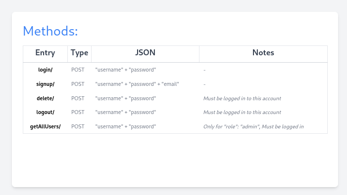
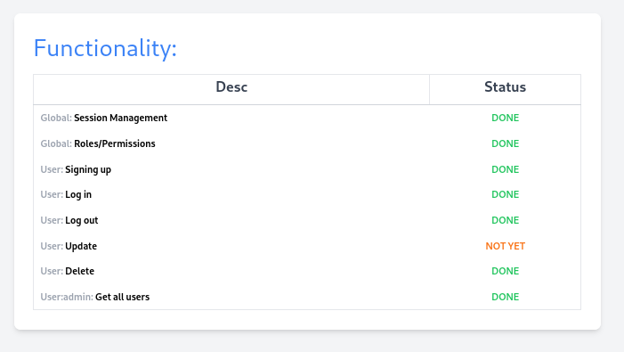
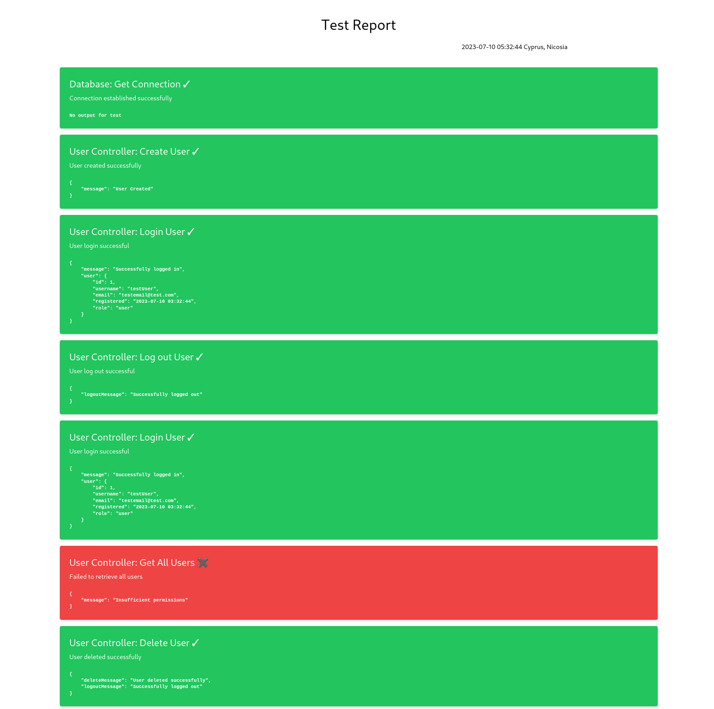

# uclan-merch-api
This API is being created to provide the functionality of a training pseudo online merchandise store from my university,
UCLan (University of Central Lancashire). This is part of the backend, the front will be implemented based on my 
gradually growing project <i>limarkdl/frontend-main-practice-own (github)</i>. The plans are to implement all the
basic authentication functionality and go deeper to learn more about the internals in order to initially create secure and fast interfaces.

<b>There is no sensitive data, it's all hidden with .htaccess and other techiques </b>

STRUCTURE:

<pre><b>.</b>
├── <b>config</b>
│   └── Database.php
├── <b>controllers</b>
│   └── UserController.php
├── <b>models</b>
│   ├── Offer.php
│   ├── Order.php
│   ├── Product.php
│   └── User.php
├── <b>public</b>
│   ├── <b>api</b>
│   │   ├── <b>delete</b>
│   │   │   └── index.php
│   │   ├── <b>getAllUsers</b>
│   │   │   └── index.php
│   │   ├── <b>login</b>
│   │   │   └── index.php
│   │   ├── <b>logout</b>
│   │   │   └── index.php
│   │   └── <b>signup</b>
│   │       └── index.php
│   ├── index.css
│   └── index.html
└── <b>tests</b>
    └── <b>Integration</b>
        ├── <b>controllers</b>
        │   └── UserController.test.php
        ├── <b>Database</b>
        │   └── getConnection.test.php
        └── Report.php
</pre>

METHODS:
 

FUNCTIONALITY:
 

REPORT EXAMPLE:
 

